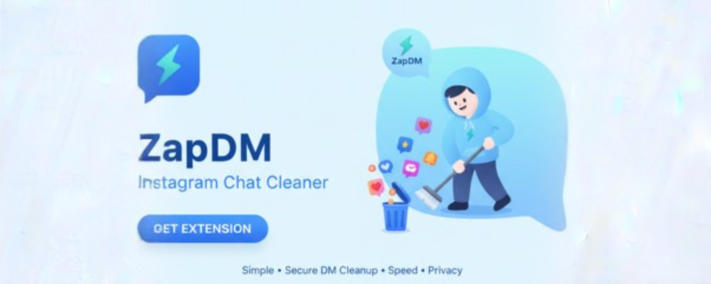
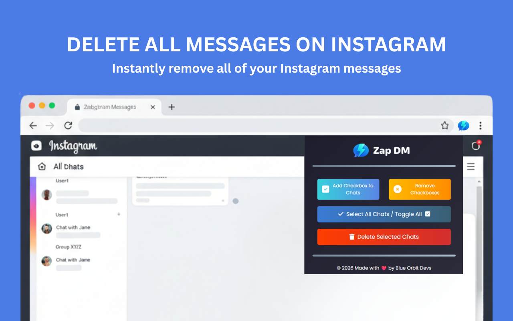
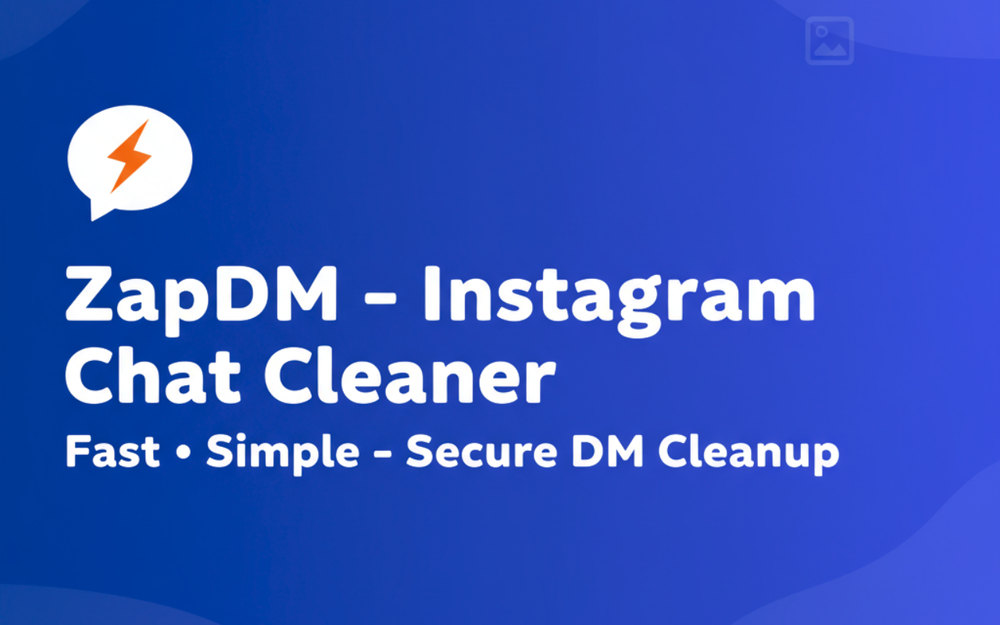

<p align="center">
  <a href="https://chromewebstore.google.com/" target="_blank">
    
  </a>
</p>

<p align="center">
  <b>Clean your Instagram DMs in seconds — remove unwanted chats, stay organized, and protect your privacy.</b>
</p>

<h1 align="center">ZapDM – Instagram Chat Cleaner</h1>

<p align="center">
  <b>Bulk Delete Instagram DMs • Message Requests • Clutter-Free Inbox</b><br>
  Version 1.0.0 • Developed by <a href="https://amitdas.site">Amit Das</a>
</p>

---

## 🧩 Overview

**ZapDM – Instagram Chat Cleaner** is a fast, secure, and privacy-focused Chrome extension that helps you **clean and manage your Instagram Direct Messages effortlessly**.

Instagram DMs quickly become cluttered with message requests, spam, inactive chats, and old conversations. Manually deleting them one by one is slow and frustrating. ZapDM solves this by allowing you to **bulk-delete unwanted DM conversations directly in your browser**, saving time while keeping your data private.

All actions run **locally** — no tracking, no external servers, and no data sharing.

---

## ⬇️ Download Extension

Get the latest version of **ZapDM** from the **Chrome Web Store** or **GitHub Releases**.

<p align="center">
  <a href="https://chromewebstore.google.com/" target="_blank">
    
  </a>
  &nbsp;&nbsp;
  <a href="#">
    
  </a>
</p>

### 🧭 Manual Installation Steps

1. Download the `.crx` file *(or install directly from the Chrome Web Store)*
2. Open `chrome://extensions/`
3. Enable **Developer Mode** (top-right corner)
4. Drag and drop the `.crx` file
5. ZapDM installs automatically ✅

---

## ⚙️ Features

✅ **Bulk DM Cleanup**

* Delete multiple Instagram DM conversations at once
* Clean message requests and inactive chats

✅ **Fast & Automated**

* One-click cleanup
* Live progress indicator
* Pause or stop anytime

✅ **Privacy-First Design**

* Runs 100% locally in your browser
* **No tracking, no analytics, no external servers**

✅ **Clean & Simple UI**

* Minimal interface that blends naturally with Instagram
* Easy to use for everyone

✅ **Multi-Language Support**

* Works with all Instagram languages worldwide

---

## 🖼️ Screenshots

### ✨ Main DM Cleanup

<p align="center"></p>

### ✨ Message Requests Cleanup

<p align="center"></p>

<!--### ✨ Cleanup in Progress

<p align="center"></p>-->

---

## 🔒 Privacy & Security

* ZapDM does **not** collect, store, or transmit personal data
* No access to Instagram credentials
* No third-party analytics or tracking
* All actions execute locally inside your browser

Read the full [Privacy Policy](PRIVACY.md).

---

## 🧰 Permissions Used

| Permission | Purpose                                              |
| ---------- | ---------------------------------------------------- |
| `storage`  | Saves user preferences and cleanup state locally     |
| `tabs`     | Detects Instagram DM tabs for user-initiated actions |

**Host Permissions:**

```
https://www.instagram.com/*
```

→ Required only to interact with Instagram Direct Messages for cleanup.

---

## 💬 Support

Have questions, issues, or feature requests?
📧 **Email:** [info@amitdas.site](mailto:info@amitdas.site)

---

## 📜 License

© 2025 **Amit Das**
All rights reserved. Redistribution or modification without permission is prohibited.

---

<p align="center">
  <b>Made with ❤️ by <a href="https://amitdas.site">Amit Das</a></b><br>
  ☕ Support development: <a href="https://paypal.me/AmitDas4321">PayPal.me/AmitDas4321</a>
</p>
